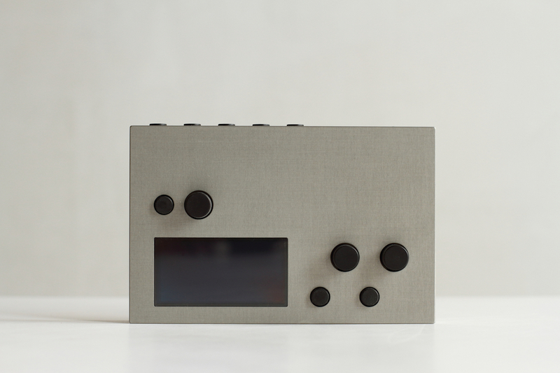

# norns

norns is many sound instruments. it is a small, portable, open-source sound computer that dynamically runs scripts and DSP, such as:

- sample-cutter
- polysynth
- algorithmic drum machine
- drone box
- granulator
- asynchronous looper
- polyphasic sequencer

through *scripts* written in [Lua](https://www.lua.org/about.html), you can define the behavior of its on-board encoders, keys, and screen, as well as any connected devices. through a large number of [pre-written libraries](../norns/reference), norns offers a platform for charting new possibilities in music-making. it connects easily to grids, MIDI devices, USB-CV interfaces, networked OSC, and other objects.

using *engines* written with [SuperCollider](https://supercollider.github.io), you can customize and create your own methods of DSP for single performances or longterm exploration. scripts choose which sound engine to use and then control its parameters using simple programming.

edit scripts through the [maiden](https://monome.org/docs/norns/maiden/) web interface over WiFi, or load norns as a network drive and use your preferred development environment. everything is stored internally on the device. once editing is done, instruments can be immediately run from the onboard selector.

norns is designed to be changed, encouraging customization and invention. we've created [studies with lots of code examples](../norns/scripting) to help get started, or you can browse the [library of prebuilt instruments](https://norns.community) made possible with the support of a vibrant international community.

norns is open source and continues to grow with the generous efforts of many contributors.

## specifications

**audio**

- 1/4". 2 output. 2 input. all line level.
- 1/4" headphone with gain.

**interface**

- 128 x 64 OLED, 16-level bright white huge pixels.
- 3 rotary encoders, standard resolution.
- 3 keys.</li>
- rear status LED indicating power and disk access.

**interconnect**

- 4 x USB ports for devices. can be expanded with a powered USB hub.
- supports up to 16 MIDI devices, 4 grids, 4 arcs, 4 HID.
- serial tty via USB-mini.

**power**

- power/charge via USB-mini. high output USB power supply included (5.25V / 2A).
- internal lipo battery 2250mAh.

**processing**

- units produced before 2021 have a compute module 3 (cm3).
- units produced during and after 2021 have a compute module 3+ (cm3+).
- quad-core 1.2ghz, 1gb RAM.
- storage: 4gb (cm3) / 32gb (cm3+).
- cs4270 i2s audio codec (low latency).

**os**

- linux with realtime kernel.

**physical**

- 6.2" x 4.0" x 0.8"
- 1.2 lbs.
- milled aluminum, hard anodized
- units produced before 2022 are grey.
- units produced during and after 2022 are black.

## resources:

semi-linear walkthrough of standard features and usability:

- [first](norns-first.pdf): a quick, printable introduction.
- [play](../norns/play): a longer introduction and a great starting point.
- [wifi / update / files](../norns/wifi-files): network connections, norns system updates, and file transfers.
- [maiden](../norns/maiden): manage projects and import scripts.
- [community scripts + mods](../norns/community-scripts): learn more about the community scripts and mods generously shared for norns.
- [control + clock](../norns/control-clock): integrate norns with other tools (eg. MIDI controllers and external synths).

additional + extended knowledge:

- [scripting](../norns/scripting): scripting studies, tutorials, and reference material.
- [help](../norns/help): deeper device and system troubleshooting.
- [norns shield](../norns/shield): information about norns DIY circuit (open-source / discontinued)

current version: [latest](https://l.llllllll.co/norns)

### contributing

norns is the result of generous contributions by many people, and the ecosystem continues to evolve. We welcome discussion and code to help further the goal of an open, dynamic instrument creation platform. Check out the [github repo](https://github.com/monome/norns). To try out the latest changes to the code, you can read about [compiling norns](../norns/compiling). There's also a guide on [extending norns](../norns/extending) if you have new functionality you'd like to add.

We're also always looking for help with [documentation](https://github.com/monome/docs), if your skills include design, instruction, or proofreading. Collective efforts have created numerous exceptional projects over the years, and there's more to a project than just code!

Found a bug? Let us know. Please file a [github issue](https://github.com/monome/norns/issues) or let us know on [lines](https://llllllll.co/t/norns-help/14016).

## acknowledgements

This project would not have been possible without [linux](https://en.wikipedia.org/wiki/Linux).  Currently we're using [Supercollider](https://supercollider.github.io) for DSP extensibility.

`matron` (control system) and `crone` (audio system) were created by [@catfact](https://github.com/catfact). `maiden` (editor) was created by [@ngwese](https://github.com/ngwese). Each grew with contributions from [@artfwo](https://github.com/artfwo), [@jah](https://github.com/antonhornquist), [@simon](https://github.com/simonvanderveldt), [@rv](https://github.com/ranch-verdin), [@pq](https://github.com/pq), [@markwheeler](https://github.com/markwheeler), [@csboling](https://github.com/csboling) and many others.

norns was initiated by @tehn (monome).
